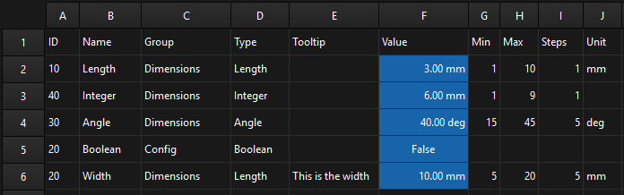

# FCCustomizer

A parametric variable manager for FreeCAD that brings OpenSCAD-like customizer functionality to your models.


## Why?

I really like the customizer in OpenSCAD, so I built this macro as a proof of concept using spreadsheets as a backbone where you can easily add and edit variables and also set min and max values. The goal is to make parametric modeling in FreeCAD as intuitive as OpenSCAD's customizer, with:

- Easy variable creation and editing. No more digging through spreadsheet cells.
- Min/Max/Step constraints to prevent users from breaking your models.
- Drag-and-drop reordering to organize variables logically within groups.
- Live preview so you can see changes instantly as you adjust sliders.
- Share-friendly design so others can adjust parameters without breaking anything.

## Features

### Variable Management
- Create, edit, and delete variables through a clean GUI
- Support for multiple types: Length, Float, Integer, Angle, Boolean, String
- Automatic alias generation for use in expressions (e.g., `Customizer.BoxWidth`)
- Group variables into logical sections


### Constraints
- Set minimum and maximum values for numeric variables
- Define step sizes for precise adjustments
- Impossible values are prevented so your model cannot break

### Interactive Controls
- Sliders with real-time snapping to step values
- Spinbox inputs for precise numeric entry
- Checkboxes for boolean values
- Text inputs for string variables
- Unit selection for Length (μm, mm, cm, m, in, ft) and Angle (deg, rad)

### Workspace
- Drag-and-drop reordering of variables within groups
- Drag variables between groups to reorganize
- Visual dimming when editing to prevent accidental changes
- Hover highlighting for better visibility


### Performance
- Debounced updates prevent lag when scrolling sliders or Spinboxes
- Optional "Live Recompute" toggle so you can disable it to batch changes

## Installation

1. Download `FCCustomizer.FCMacro` from this repository
2. In FreeCAD, go to **Macro > Macros...**
3. Click **Create** and give it a name (e.g., `FCCustomizer`)
4. Paste the macro code and save
5. Run the macro from **Macro > Macros...** or add it to a custom toolbar

## Usage

### Getting Started
When you run the macro, it automatically creates a spreadsheet named "Customizer" at the root of your project if one does not already exist. This spreadsheet stores all your variables and persists with your FreeCAD document.

### Creating Variables
1. Click the **+ Add Variable** button
2. Enter a **Name** (this becomes the alias, use something like `BoxWidth`)
3. Optionally set a **Group** (e.g., "Dimensions", "Features")
4. Choose a **Type** from the dropdown
5. Set an initial **Value**
6. Optionally set **Min**, **Max**, and **Step** values for constrained variables
7. Click **Save Variable**

### Editing Variables
1. Click on any variable
2. Modify the values in the edit form
3. Click **Update Variable** to save changes
4. Or click **Delete** to remove the variable

### Using Variables in Your Model
Reference your variables in expressions using the spreadsheet alias:

```
Customizer.BoxWidth
Customizer.WallThickness
```

### Reordering Variables
- Grab the drag handle on the left of any variable
- Drag it to a new position within the same group
- Drop it on a different group to move it there

### Keyboard Shortcuts
- **Escape**: Cancel editing, close add form, or clear field focus
- **Enter**: Accept field input

## How It Works

FCCustomizer uses a FreeCAD spreadsheet named "Customizer" as its data store. If this spreadsheet does not exist when you run the macro, it is automatically created at the root of your active document. The spreadsheet has the following columns:

| Column | Purpose |
|--------|---------|
| ID | Auto-assigned ordering number |
| Name | Variable name (also used as alias) |
| Group | Category for organization |
| Type | Length, Float, Integer, Angle, Boolean, String |
| Tooltip | Optional description |
| Value | The actual value (in base units) |
| Min | Minimum constraint |
| Max | Maximum constraint |
| Steps | Step size |
| Unit | Display unit (mm, cm, deg, etc.) |



The spreadsheet approach means your variables persist with your FreeCAD document and can be shared with others and nothing breaks if the macro is not present.

## Tips

- Disable **Live Recompute** when making many changes in big projects to avoid slowdowns
- Use meaningful names for variables since they become the aliases used in expressions
- Group related variables together for better organization
- Set Min/Max values when sharing models to prevent others from entering impossible values
- The Unit dropdown converts values automatically. Entering `10` with unit `cm` stores `100 mm` internally.

## Requirements

- FreeCAD 1.0 or later

## Contributing

This is a personal project I built to solve my own frustration with FreeCAD's variable system. If you find bugs or have ideas for improvements, feel free to open an issue or pull request.

## Credits

Developed with ❤️ by [Davi Be](https://github.com/DaviBe92)